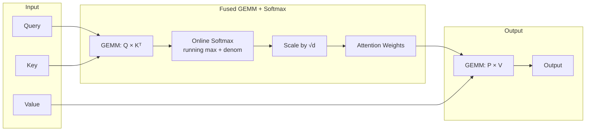
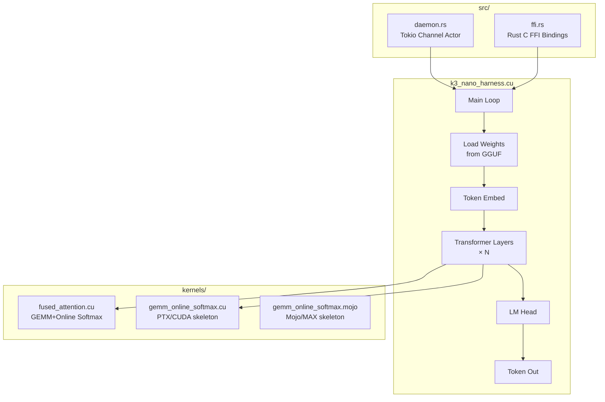
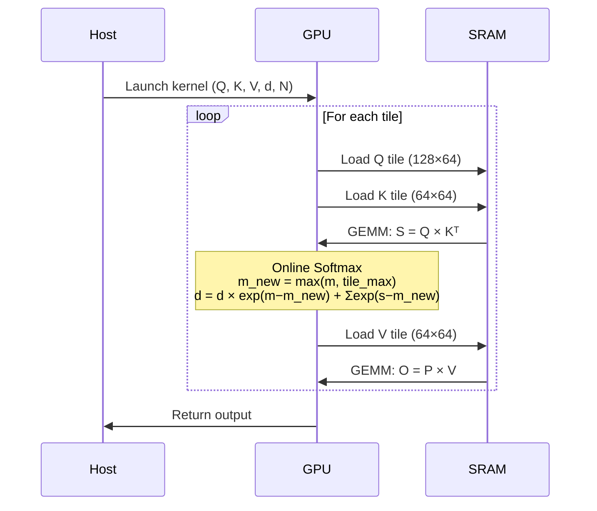
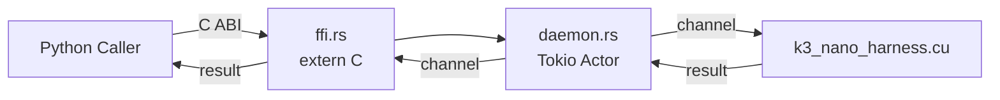
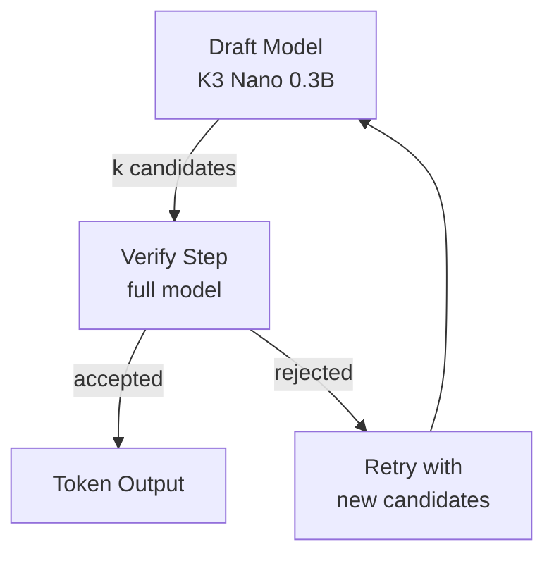

<div align="center">

# sovereign-kimi

**Kimi K3 Nano CUDA Attention Kernels · GEMM + Online Softmax · WMMA FP16 · Speculative Decoding**

[](LICENSE)
[](LICENSE)
[](LICENSE)
[](k3_nano/kernels/)
[](k3_nano/kernels/)
[](k3_nano/src/)
[](k3_nano/kernels/)
[](k3_nano/)

Sovereign GPU attention engine: fused GEMM + online softmax, WMMA tensor core kernels, speculative decoding, Rust FFI, and a production inference harness.

</div>

---

## Kernel Pipeline



## Harness Architecture



## Kernel Files

| File | Type | Description |
|------|------|-------------|
| `kernels/fused_attention.cu` | CUDA C++ | Production GEMM + online softmax kernel |
| `kernels/gemm_online_softmax.cu` | PTX/CUDA | PTX-level skeleton with inline assembly |
| `kernels/gemm_online_softmax.mojo` | Mojo/MAX | GPU kernel skeleton for MAX runtime |

## Fused Attention Flow



## Rust FFI + Daemon



## Build

```bash
cd k3_nano

# Full build (all kernels)
make all

# Individual targets
make attention      # fused_attention only
make gemm           # gemm_online_softmax only
make draft          # speculative drafting
make test           # compile + run test
make spec           # load spec from config/g6_architecture.json
```

## Speculative Decoding



## G6 Architecture

| Parameter | Value |
|-----------|-------|
| Draft model | K3 Nano 0.3B |
| Target model | G6 6.15B |
| Speculation depth | k=4 |
| Acceptance rate target | ≥70% |
| Latency reduction | 2–3× |

---

## Topics

`CUDA` `attention` `GEMM` `online-softmax` `WMMA` `FP16` `tensor-cores` `speculative-decoding` `Kimi` `K3-Nano` `Rust-FFI` `Mojo` `Mojo-MAX` `GPU-kernels` `sovereign`

---

**Sovereign Source License v1.0 + BSL-1.1 + AGPL-3.0 (tri-license)**

Ahmad Ali Parr · Bel Esprit D'Accord Irrevocable Trust · EIN 42-697643
